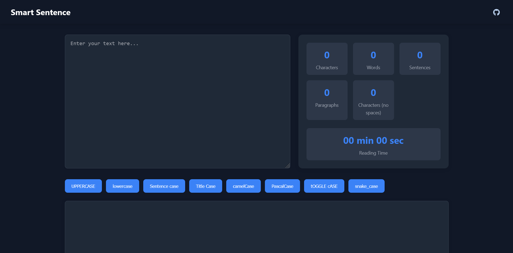

# ✨ Smart Sentence

**Smart Sentence** is a powerful web tool that helps you perform intelligent string manipulations and analyze text metrics in real-time. Whether you're a writer, developer, or just someone dealing with text, Smart Sentence makes working with strings efficient and enjoyable.

🌐 [Visit the app →](https://smart-sentence.10cyrilc.in/)

---

## 🎯 Features

- 🔠 Convert text into multiple formats:
  - UPPERCASE
  - lowercase
  - Sentence case
  - Title Case
  - camelCase
  - PascalCase
  - tOGGLE cASE
  - snake_case
  - kebab-case
  - dot.case
  - aLtErNaTiNg cAsE

- 📊 Live text analysis:
  - Character count
  - Word count
  - Sentence count
  - Paragraph count
  - Character count (no spaces)
  - Average word length
  - Estimated reading time

- 💻 Simple, clean, responsive UI
- ⚡ Works offline (static site compatible)

---

## 🛠 Tech Stack

- HTML5
- CSS3
- JavaScript (Vanilla)

---

## 🧩 SEO Optimized

- Meta tags for description, keywords, and Open Graph
- Structured data via [schema.org](https://schema.org/)
- `sitemap.xml` and `robots.txt` included
- Canonical URLs
- Mobile-friendly and fast-loading

---

## 📸 Preview



---

## 🗂 Directory Structure

```bash
smart-sentence/
├── index.html
├── styles.css
├── script.js
├── README.md
├── sitemap.xml
├── robots.txt
├── assets/
│   ├── favicon.ico
│   ├── github.png
│   └── og-image.png
```

---

## 📦 Deployment

Smart Sentence is a static app and is hosted on:
- [Vercel](https://vercel.com/)

---

## 📬 Contributing

Pull requests are welcome! If you find a bug or have a feature request, feel free to [open an issue](https://github.com/10cyrilc/smart-sentence/issues).

---

## 📄 License

MIT License © [10cyrilc](https://github.com/10cyrilc)

---

## 🔗 Links

- 🔗 Website: [https://smart-sentence.10cyrilc.in](https://smart-sentence.10cyrilc.in)
- 🐙 GitHub: [10cyrilc/smart-sentence](https://github.com/10cyrilc/smart-sentence)